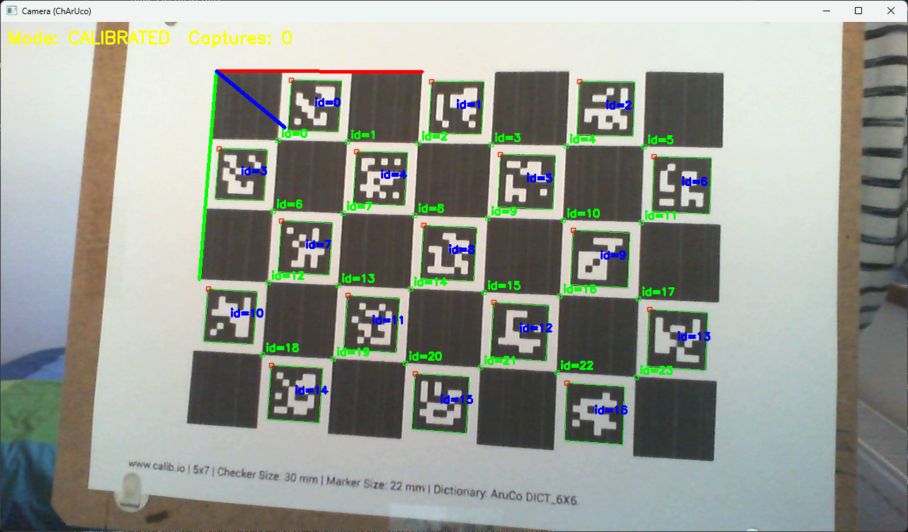

# AR Playground

Hands-on playground for learning augmented reality with:

- OpenCV + ChArUco camera calibration and pose estimation
- Raw OpenGL rendering (wireframe cube)
- Pyrender rendering (offline model preview + camera compositing)

This project explores core AR concepts through hands‑on prototypes focused on calibration, pose estimation, and 3D rendering.

I built this project to deepen my understanding of augmented reality fundamentals, starting from camera calibration and gradually extending into real‑time 3D rendering.

The repository documents the approach I used, including practical insights, implementation decisions, and challenges encountered along the way.

## Setup Python virtual environment (venv)

**Create a virtual environment**

```bash
python -m venv .venv
```

**Activate it**

Windows (cmd):

```bat
.venv\Scripts\activate
```

macOS / Linux:

```bash
source .venv/bin/activate
```

**Install dependencies**

```bash
pip install -r requirements.txt
```

**Run scripts with the venv interpreter**

In VS Code, pick `.venv` as your Python interpreter.

Or run directly:

```bash
.venv/Scripts/python.exe calibrate_camera.py
```

## Camera calibration

This project uses a printed ChArUco board for calibration and pose.

- OpenCV calibration docs: https://docs.opencv.org/3.4/d9/d0c/group__calib3d.html
- ChArUco detection docs: https://docs.opencv.org/4.x/df/d4a/tutorial_charuco_detection.html
- Board generator used: https://calib.io/pages/camera-calibration-pattern-generator

### Why calibration matters

Cheap webcams usually have visible distortion. Calibration estimates intrinsics (camera matrix + distortion coefficients), allowing the system to recover more accurate pose from board detections.

### How to calibrate (`calibrate_camera.py`)

1. Start with no calibration file (or move old one out of the way).
2. Run:

	```bash
	.venv/Scripts/python.exe calibrate_camera.py
	```

3. Move the ChArUco board through different positions/angles/distances.
4. Keyboard controls:
	- `c`: capture current ChArUco detection (needs >3 corners)
	- `k`: run calibration from captured samples
	- `r`: reset captured samples
	- `q`: quit

Practical tip: collect many varied views (for example, ~25-40) to improve calibration quality. Position and tilt the charuco board so that you have a good variety of poses captured.

Current behavior:

- Captured images are written into a `captures...` folder, created on the first successful capture.
- Calibration is saved to `calib.npz`.

### Verify your calibration visually

After calibration, run `calibrate_camera.py` again and load your saved calibration file in `load_calibration()` function.
If calibration is correct, you should see the axes rendered on the image and anchored to the top-left ChArUco corner (the board origin, `0,0`).



## Rendering modules

### 1) `gl_render.py` (raw OpenGL wireframe cube)

This script demonstrates AR rendering with PyOpenGL + Pygame:

- Uses OpenCV to detect the ChArUco board and estimate board pose
- Converts pose to OpenGL model-view space
- Draws the camera frame as background
- Renders a wireframe cube (plus axes/ground) anchored to the detected board

Think of this as the "low-level" rendering reference where you directly control OpenGL calls.

### 2) `pyrender_renderer.py` (standalone car render)

This is a non-AR preview of the model pipeline:

- Loads `Jeep_Renegade_2016.obj`
- Creates a Pyrender scene with light + camera
- Opens a viewer showing the car render only

This script is useful for verifying model loading, materials, and scene setup before integrating with camera tracking.

### 3) `pyrender_offscreen_opencv.py` (full AR demo)

This is the end-to-end demo that combines tracking + rendering + compositing:

- Reads camera frames via OpenCV
- Estimates board pose using ChArUco
- Converts pose into a camera transform for Pyrender
- Renders the Jeep model offscreen
- Uses depth mask compositing to overlay rendered pixels onto the camera frame
- Displays final AR output in real-time

This is where all pieces connect into a functional AR overlay of the 3D car on the board.


## Notes and troubleshooting

- Camera index may need adjustment (`openCapture(0)` vs `openCapture(1)`) depending on your system.
- Keep calibration filenames and paths consistent across scripts. Some scripts reference specific files in `calibration/`, so when using a given camera, update the filename passed to `load_calibration()` in the script you run.
- If rendering is laggy, reduce camera resolution and avoid per-frame model reloads.

## Suggested run order

1. Run `calibrate_camera.py` to calibrate the camera you plan to use.
2. Run `pyrender_offscreen_opencv.py` for the AR demo. Before running, confirm the camera index in `openCapture()` and the calibration filename in `load_calibration()` are correct.